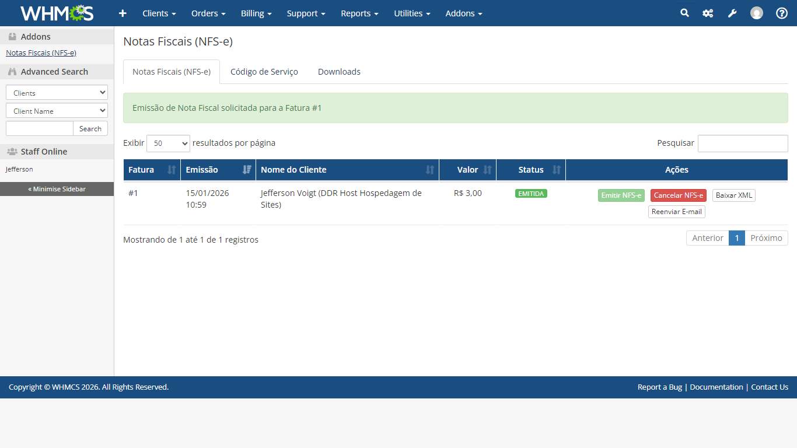
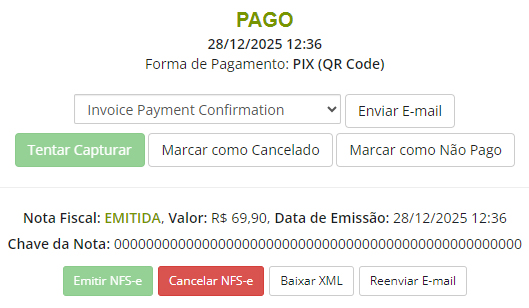

# Módulo de Notas Fiscais (NFS-e) para WHMCS via API Nacional

> Automatize a emissão de **NFS-e** no WHMCS com integração direta ao **Ambiente Nacional** (Sefin Nacional / nfse.gov.br).

Este módulo integra o WHMCS à **API Nacional de NFS-e**, permitindo operar a rotina completa de emissão de notas fiscais de serviço **SEM DEPENDER DE TERCEIROS** e **SEM COBRANÇA POR NOTA FISCAL**.

Permite emissão manual ou automática, cancelamento, download do XML e reenvio de e-mail, com controles por gateway, grupo de cliente e mapeamento de Código de Serviço.

---

## Principais Recursos

- Emissão de NFS-e diretamente no WHMCS via API Nacional
- Emissão manual (ação sob demanda no Admin)
- Emissão automática após pagamento (conforme regras do módulo)
- Cancelamento de NFS-e (quando status = emitida)
- Download do XML (Admin e ClientArea)
- Reenvio de e-mail da NFS-e
- Painel de listagem de notas emitidas no Admin (com busca e ordenação)
- Acompanhamento de status: Emitida, Cancelada, Erro
- Página própria na Área do Cliente (`index.php?m=Nfse`)

---

## Área do Cliente (ClientArea)

O módulo possui página própria na área do cliente:
index.php?m=Nfse

### Funcionalidades

- Listagem de todas as NFS-e do cliente
- Ordenação por Data, Valor e Status (DataTables)
- Filtro por status (Emitida / Cancelada)
- Download do XML
- Reenvio de e-mail
- Consulta pública via chave de acesso
- Visualização da fatura vinculada
- Mensagens de sucesso e erro após ações
- Compatível com tema Lagom
- Compatível com tema Six

---

## Controles e Regras Operacionais

- Restrição de emissão automática por Gateways
- Restrição de emissão automática por Cliente
- Mapeamento de CPF/CNPJ via Campo Personalizado
- Emissão imediata, via CRON (Antecipado) ou manual configurável
- Cancelamento protegido por status

---

## Código de Serviço — Diferencial do Módulo

A aba **Código de Serviço** permite controlar com precisão a classificação do serviço na NFS-e:

### Configuração Global

- Código de Serviço padrão global
- Código padrão aplicado automaticamente quando o campo estiver em branco

### Configuração por Produto/Serviço

- Código de Serviço individual por Produto/Serviço
- Herança automática do Código de Serviço padrão quando não definido

### Configuração para Domínios

- Código de Serviço exclusivo para:
  - Registro de Domínio
  - Transferência de Domínio
  - Renovação de Domínio

### Regras Inteligentes

- Código vazio utiliza automaticamente o Código de Serviço padrão
- Permite personalização por tipo de item faturado
- Evita classificação incorreta na NFS-e
- Compatível com exigências municipais

---

## Operação no Admin

- Listagem com DataTables (busca e ordenação)
- Botões de ação rápida:
  - Emitir NFS-e
  - Cancelar NFS-e
  - Baixar XML
  - Reenviar E-mail
- Regras automáticas de habilitar/desabilitar botões por status
- Operação segura para volume elevado

---

## Armazenamento e Recuperação do XML

- Armazenamento do XML no banco de dados
- Suporte a XML retornado compactado (`nfseXmlGZipB64`)
- Extração automática do XML para download
- Preserva dados relevantes mesmo em fluxos de erro

---

## Certificado Digital

- Suporte a Certificado A1 (.pfx / .p12)
- Tratamento de erro SSL
- Compatível com PHP 7.2+
- Debug avançado para diagnóstico

---

## Logs e Auditoria

- Registro no Activity Log do WHMCS
- Registro detalhado de erros
- Criação automática de To-Do em caso de falha (configurável)
- Histórico completo para auditoria

---

## E-mails

- Template WHMCS: "Nota Fiscal"
- Envio automático após emissão
- Reenvio manual pelo Admin
- Reenvio pelo Cliente (quando permitido)
- Envio com chave de acesso e link para consulta pública

---

## Estrutura de Status

| Status    | Comportamento |
|-----------|--------------|
| Emitida   | Permite XML, consulta pública e reenvio |
| Cancelada | Apenas visualização |
| Erro      | Registro mantido para auditoria |

---

## Referências

Portal Nacional de Consulta Pública:
https://www.nfse.gov.br/consultaPublica

---

## Compra

DDR Host:
https://cliente.ddrhost.com.br/cart.php?a=add&pid=281
